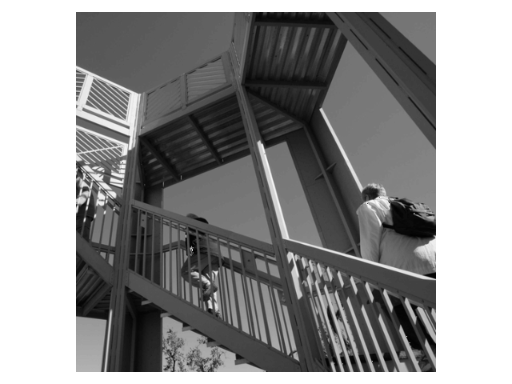
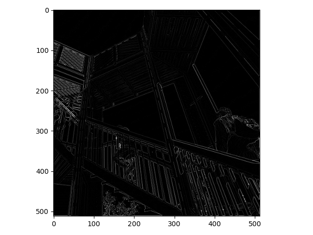
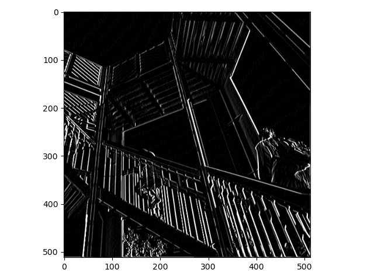
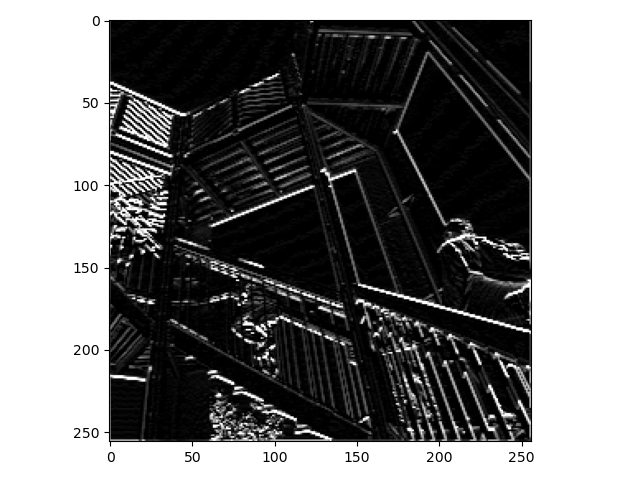
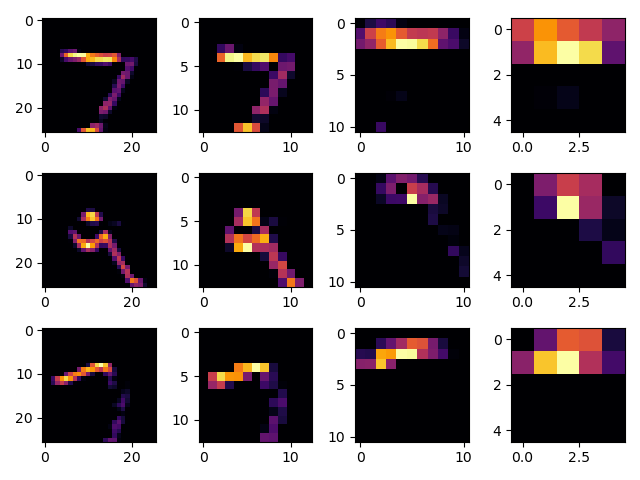

## Last week you did an exercise where you manually applied a 3x3 array as a filter to an image of two people ascending an outdoor staircase.  Modify the existing filter and if needed the associated weight in order to apply your new filters to the image 3 times.  Plot each result, upload them to your response, and describe how each filter transformed the existing image as it convolved through the original array and reduced the object size.  What are you functionally accomplishing as you apply the filter to your original array (see the following snippet for reference)?  Why is the application of a convolving filter to an image useful for computer vision? 
Here is the photo that the filters are applied to:

The first filter emphasized the edges of the photo. It made it easier to see the boundaries where objects meet. 
This could be useful for detecting things like corners in rooms or distinguishing between two objects.

The second filter enhances vertical lines. It made the vertical crossbars on the staircase very distinct, even though they 
don't take up much of the image.

The third filter enhances horizontal lines. It made the horizontal crossbars very obvious. Lower down on the stairs, where
there are vertical crossbars, they hardly show up. This makes it easy to see the legs of the person walking up them. If
I were trying to find the shape of people, this photo would be extremely useful.

## Another useful method is pooling.  Apply a 2x2 filter to one of your convolved images, and plot the result.  In effect what have you accomplished by applying this filter?  Can you determine from the code which type of pooling filter is applied, and the method for selecting a pixel value (see the following snippet)?  Did the result increase in size or decrease?  Why would this method be method? 
By pooling the image its size has been reduced, and the effect of the horizontal filter has been increased. Each set of
four dots is searched for the brightest dot, and that dots value is used as the new value. This is called max pooling. The
top left pixel is the one that is being pooled to. This method speeds up model predictions, as there is less data to work on,
without losing too much information. It also increases the effects of other filters by completely removing some pixels they 
didn't pick up on. This pooling reduced the image size by half in each dimension, reducing it to a fourth the size in total.

## The lecture for today (Coding with Convolutional Neural Network) compared the application of our previously specified deep neural network with a newly specified convolutional neural network.  Instead of using the fashion_MNIST dataset, use the mnist dataset (the hand written letters) to train and compare your DNN and CNN output.      Were you able to improve your model by adding the Conv2D and MaxPooling2D layers to your neural network?  Plot the convolutions graphically, include them in your response and describe them.  Edit the convolutions be changing the 32s to either 16 or 64 and describe what impact this had on accuracy and training time.  What happens if you add more convolution layers?\
The deep neural network only took around 5 seconds per epoch. The loss and accuracy values for test set validation were:
[0.07702658325433731, 0.9771999716758728]

With 32 Convolutions each epoch took ~20 seconds. The loss and accuracy values for the test set were:
[0.050935469567775726, 0.9846000075340271]

With 16 Convolutions each epoch took ~13 seconds. The loss and accuracy values for the test set were:
[0.044564686715602875, 0.9868999719619751]

I can definitively say while faster, the Deep Neural Network was not as effective at predicting on this dataset.
The Conv2D and MaxPooling2D layers improved the model greatly.

I'm surprised that the set with lower convolutions scored better. I was expecting the model with less convolutions to be 
faster to train, but less accurate. This run where it was more accurate may have just been a fluke and not a trend.

A second run gave more expected results:

With 32 Convolutions
[0.03981027379631996, 0.987500011920929]

With 16 Convolutions
[0.047929905354976654, 0.984000027179718]

Still these are closer than expected.