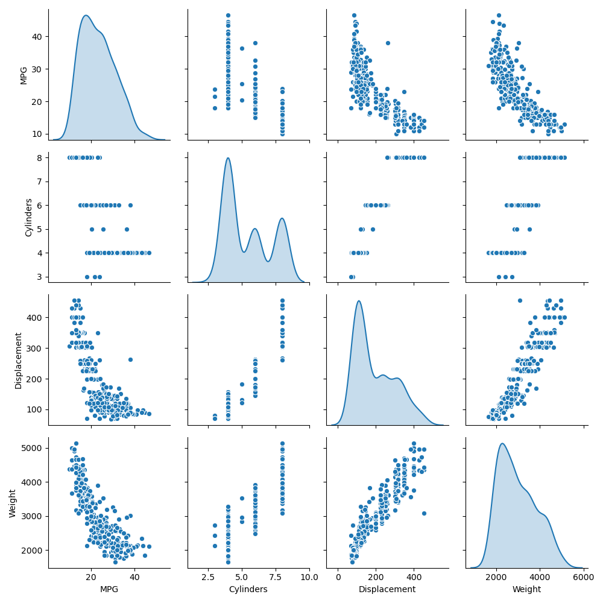
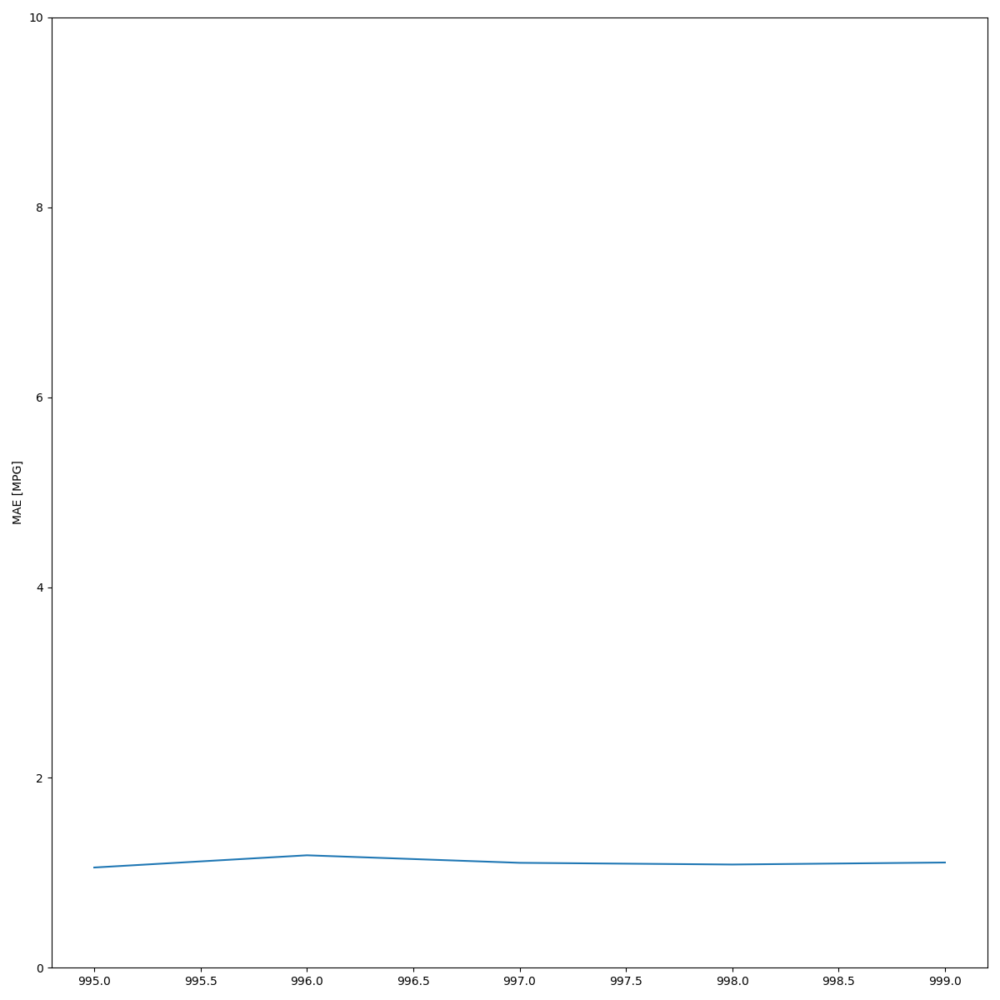
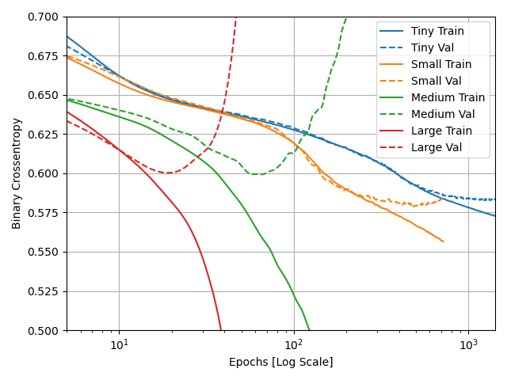

# Convolutional Horses and Humans

## Describe the ImageDataGenerator() command and its associated argument.  What objects and arguments do you need to specify in order to flow from the directory to the generated object?  What is the significance of specifying the target_size = as it relates to your source images of varying sizes? What considerations might you reference when programming the class mode = argument?  How difference exists when applying the ImageDataGenerator() and .flow_from_directory() commands to the training and test datasets?

The image data generator takes in a set of images and augments them all. It returns them as batches. It doesn't have to 
augment the images the same way, and so can be used to artificially create additional variation in the data set. It needs 
to know how the data will be edited. For example we rescaled the data. It then can be used to create a directory and output
images using the flow_from_directory command. The flow_from_directory method can be used to take this data and extract it. flow_from_directory()
takes in target size as an argument for how many pixels the image should be as a tuple (height,width). Class mode is how 
the data is sorted into batches, either binary data, in which the batches are sorted into two sets, or categorical if there is 
more than one set for the data. 

# Regression

## 1.Using the auto-mpg dataset (auto-mpg.data), upload the image where you used the seaborn library to pairwise plot the four variables specified in your model.  Describe how you could use this plot to investigate the co-relationship amongst each of your variables.  Are you able to identify interactions amongst variables with this plot?  What does the diagonal access represent?  Explain what this function is describing with regarding to each of the variables.

The pairwise plot shows the interaction between each of the variables. Trends might be able to be seen by looking at it. 
For example, MPG seems to be inversely related to weight. The diagonal is the Kernel Density Estimate. As comparing a 
to itself isn't helpful, the graph instead shows how frequent each level of observation is compared to the others. 
This gives a little information into the distribution of all of the variables.

## 2. After running model.fit() on the auto-mpg.data data object, you returned the hist.tail() from the dataset where the training loss, MAE & MSE were recorded as well as those same variables for the validating dataset.  What interpretation can you offer when considering these last 5 observations from the model output?  Does the model continue to improve even during each of these last 5 steps?  Can you include a plot to illustrate your answer?  Stretch goal: include and describe the final plot that illustrates the trend of true values to predicted values as overlayed upon the histogram of prediction error.  

| epoch |        loss |      mae  |     mse |  val_loss  | val_mae  |  val_mse  |
|---|----|----|----|----|----|----|
|995 | 2.782892 | 1.054306 |  2.782892 | 10.036884 | 2.369124 | 10.036884 |   
|996 | 3.028865 | 1.182826 | 3.028865  |  9.857905  | 2.450383  | 9.857905  | 
|997 | 2.940937 | 1.103614 | 2.940937  | 9.521159  | 2.306947 | 9.521159 | 
|998 | 2.777515 | 1.085731 | 2.777515  | 10.240467  | 2.324893  | 10.240467  |  
|999 | 2.918034 | 1.106805 |  2.918034 | 10.024806 | 2.463822 | 10.024806 |  

In the last 5 observations, the model's loss values fluctuate slightly. This up and down indicate that the model is as 
well trained as it can be with the current settings. More epochs won't significantly improve performance. They might in 
fact reduce it's performance on a test set by overfitting it.

# Overfit and Underfit

## What was the significance of comparing the 4 different sized models (tiny, small, medium, large)?  Can you include a plot to illustrate your answer?

By comparing models with different size datasets you can see how the amount of training data affects how quickly a model 
becomes overfit. The tiny dataset model did eventually become overfit, but even up to 1000 epochs it's Binary Cross Entropy
was decreasing on both the train and test sets. The large dataset model meanwhile was overfit by 150 epochs. It began to 
get significantly worse from there, with its train binary cross entropy dropping quickly, but it's evaluation binary cross entropy
skyrocketing. It seems that the larger the dataset, the fewer epochs can be used before the model begins to overfit. Which
I personally consider a bonus, as each epoch takes longer for the larger datasets. It'd be a real hassle if they got increasingly
better. Though I suppose it'd be good for making predictions

