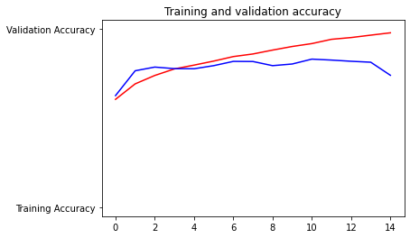

## Project Statement

I intend to train a machine learning model to detect tumors or other abnormalities in MRI scans. 
Being able to detect the existence of tumors in MRI's is the first step to making a categorical model that can determine
what is afflicting a patient using MRI scans. As this is a computer vision problem, I will need to use datasets that are 
large in terms of memory. This will make getting enough data into a model to train it well difficult. 

## Describe your implementation of the cats & dogs exercise. How did you setup the data?  
 
### 1.Which optimizer have you selected, and how might it compare to other possible choices?  (have a look at this site - https://towardsdatascience.com/understanding-rmsprop-faster-neural-network-learning-62e116fcf29a)
    
For this I used RMSprop. RMSprop has an adaptive learning rate, meaning that it will be able to train quicker than other 
optimizers. Rprop, which it is based off of, also has an adaptive learning rate. However, it isn't designed to work with 
small batch sizes. As I want to use small batches for this assignment, I chose RMSprop.  

### 2.Describe your selected loss function and it’s implementation.  How is it effectively penalizing bad predictions? (have a look at this site - https://towardsdatascience.com/understanding-binary-cross-entropy-log-loss-a-visual-explanation-a3ac6025181a)

Binary cross entropy uses a negative log function to score the model's predictions. For every point, it takes the probability
it predicted for the correct categorization. It makes its predictions on a scale of 0-1. So, if the model predicted a probability of one
correctly, it'll add the -log(1) the loss. Which is 0. This means that correct answers don't add anything to the loss. Conversely
if it had predicted 0.01, it would add -log(0.01), or 2 to the total loss. The total loss is divided by the number of 
points to get the average loss. This is what the loss function returns. Bad predictions affect the loss more than good due 
to the nature of log functions.

### 3.What is the purpose of the metric= argument in your model.compile() function? (look here - https://keras.io/api/metrics/)

Metrics are methods of determining a model's performance. Every loss function can be used as a metric. Unlike loss functions
the metric isn't used to affect the model's training. It is only a method of scoring for the user to see. Or, they can add 
callbacks that use the metric as a parameter.

### 4.Plot the accuracy and loss results for both the training and test datasets.  Include these in your response.  Assess the model and describe how good you think it performed.

The model is overfit. It has an accuracy in training of 98% and testing of 75%. Still I think this is a decent model. Less
epochs would help this model perform better, one epoch had a testing accuracy of 80%. The loss values also show that the test is overfit.

### 5.Use the model to predict 3 dog images and 3 cat images.  Upload you images and the prediction.  How did your model perform in practice?  Do you have any ideas of how to improve the model’s performance?

cat1.jpg is a dog

cat2.jpg is a dog

cat3.jpg is a dog

dog1.jpg is a dog

dog2.jpg is a dog

dog3.jpg is a cat

This model performed terribly, only correctly identifying 2 images. The model should be trained with more diverse data to 
improve performance.