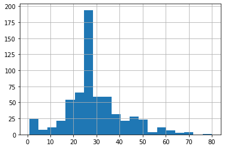

## Premade estimators

### How did you split the labels from the training set?  What was the name of the labels dataset?

By using the pop command on the training set dataframe, and storing the information in a new variable. It was called train_y.

### List 5 different estimators from tf.estimator and include the base command as you would write it in a script (for example this script used the tf.estimator.DNNClassifier() function from the API).

Baseline Estimator, tf.estimator.BaselineEstimator().

Boosted Trees Estimator, tf.estimator.BoostedTreesEstimator()

Linear Estimator, tf.estimator.LinearEstimator()

DNN Estimator, tf.estimator.DNNEstimator()

DNN Linear Combined Estimator,tf.estimator.DNNLinearCombinedEstimator()

### What are the purposes input functions and defining feature columns?

Input functions can be used to automatically insert data into other functions according to some algorithm. 

### Describe the command classifier.train() in detail.  What is the classifier and how did you define it?  Which nested function (and how have you defined it) are you applying to the training and test detests?

The classifier is a DNNClassifier that was defined using the tf.keras.DNNClassifier command. It has two hidden layers with
30 and 10 nodes in them. It predicts between 3 different classes. Inside the train function input_fn() method is defined. 
It feeds in the training data and training labels as well as the number of steps to the classifier.train() method.

### Redefine your classifier using the DNNLinearCombinedClassifier() as well as the LinearClassifier().  Retrain your model and compare the results using the three different estimators you instantiated.  Rank the three estimators in terms of their performance.
|DNN Classifier|          |
|---|----|    
|Prediction is "Setosa" (79.0%)| expected "Setosa"|
|Prediction is "Virginica" (45.3%)| expected "Versicolor"|
|Prediction is "Virginica" (63.5%)| expected "Virginica"|

|DNN Linear Classifier|          |
|---|----| 
|Prediction is "Setosa" (87.9%)| expected "Setosa"|
|Prediction is "Versicolor" (57.6%)| expected "Versicolor"|
|Prediction is "Virginica" (69.1%)| expected "Virginica|

| Linear Classifier|          |
|---|----| 
|Prediction is "Setosa" (99.2%)| expected "Setosa"|
|Prediction is "Versicolor" (97.4%)| expected "Versicolor"|
|Prediction is "Virginica" (95.9%)| expected "Virginica"|

The linear Classifier was by far the best model. Since the mix off DNN and linear classifier was the second best, I 
suspect the DNN component brought down the linear components performance. The just DNN classifier performed the worst. 
The data must be delineated in a clearly linear fashion for the linear classifier to have performed so well.

## Build a Linear Model

### Using the dftrain dataset, upload an image where you used the seaborn library to produce a sns.pairplot().  Also include a histogram of age using the training set and compare it to the seaborn plot for that same feature (variable).  What interpretation can you provide of the data based on this plot?

The diagonal is providing a smoothed version of the distribution that the histogram shows for age. 
I don't see any clearly useful correlations between data points in this pairplot.

### What is the difference between a categorical column and a dense feature?

A categorical column classifies an object as a type from a list of possible types. A dense feature can indicate the absence
of data, while a classifier can't. No data is treated as usual information while no category is treated as an error or a type
of its own.

### Describe the feature columns that have been input to your LinearClassifier().  How would you assess the result from your initial output?  What is the purpose of adding a cross featured column?  Did your attempt to capture the interaction between age and gender and incorporate it into your model improve performance?  Include and interpret your predicted probabilities and ROC curve plots.

The features that are input are: ['sex', 'n_siblings_spouses', 'parch', 'class', 'deck', 'embark_town', 'alone', age', 'fare']
They have data on the gender, number of siblings aboard, number of children or parents, class of ticket, deck assigned, which town they embarked from,
whether they were alone as a binary feature, their age and the amount of fare paid.

75% accuracy for the initial output isn't a bad start. Crossed feature columns explore if a combination of variables is important.
By adding an interaction between the age and sex of the passenger, the accuracy increases 2.7%.

