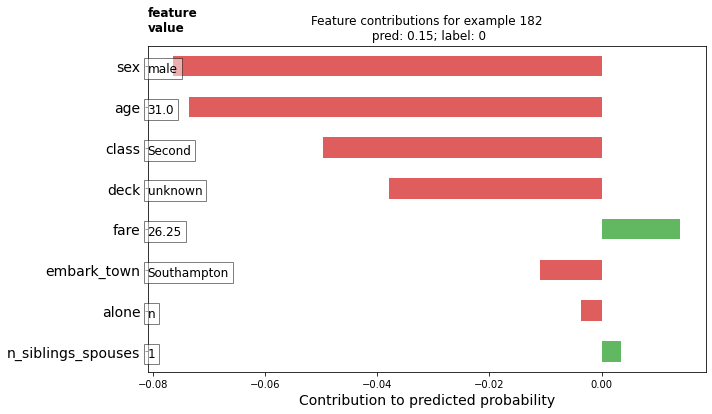
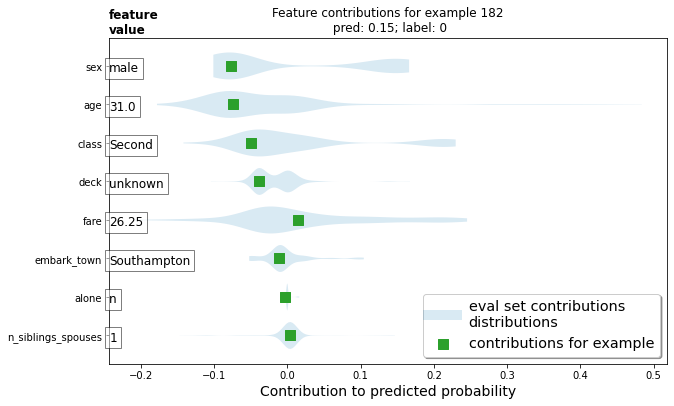
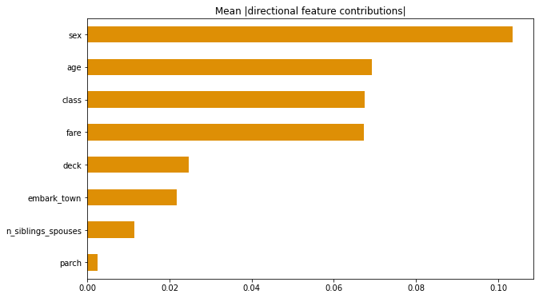
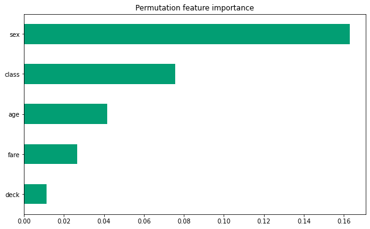

## Boosted Trees
 
### 1. What is a one-hot-encoded column and why might it be needed when transforming a feature?  Are the source values continuous or discrete? 

One-hot-encoding is used for categorical data that isn't ordinal. Algorithms may assume an ordering if categories are 
labeled as 1, 2, 3... To ensure they don't try to create an order, the features are separated. Each category gets its own 
column. A discrete value of 1 or 0 for whether or not it has that feature. A blue object would have a 1 in the blue
column and a 0 in the red and green columns, for example. 

### 2. What is a dense feature?  For example, if you execute example = dict(dftrain) and then tf.keras.layers.DenseFeatures(your_features)(your_object).numpy(), how has the content of your data frame been transformed?  Why might this be useful?

The absence of data can still be data. Dense features evaluate a lack of data as 0. This is useful for one-hot-encoding, 
as they are dense by definition. They contain information about whether that observation includes a feature or not. This is
useful when missing or 0 observations of features are good predictors.

### 3.Provide a histogram of the probabilities for the logistic regression as well as your boosted tree model.  How do you interpret the two different models?  Are their predictions essentially the same or is there some area where they are noticeable different.  Plot the probability density function of the resulting probability predictions from the two models and use them to further illustrate your argument.  Include the ROC plot and interpret it with regard to the proportion of true to false positive rates, as well as the area under the ROC curve.  How does the measure of the AUC reflect upon the predictive power of your model?

## Boosted Trees continued (with model understanding)

### 1.Upload your feature values contribution to predicted probability horizontal bar plot as well as your violin plot.  Interpret and discuss the two plots.  Which features appear to contribute the most to the predicted probability?

This plot shows the importance of variables by their size. The red left leaning variables are of negative importance, meaning
they are factors whose presence lowers the chance of survival.

The violin plot shows the distribution of variables as well as how important those observations are. 

Sex of male and age of 31 seem to be the most important variables indicating a passenger will not survive.  The number of siblings
looks to be the least important of the listed features.

### 2.Upload at least 2 feature importance plots.  Which features are the most important in their contribution to your models predictive power?

Sex and age are by far the most important two features. Class and fare are also important. The least important listed is parch.

