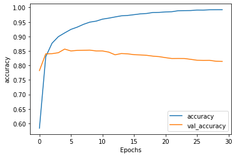
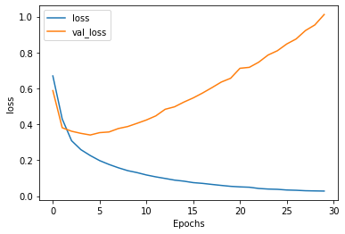
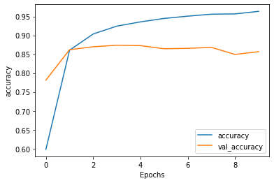
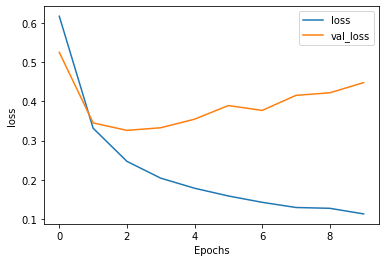
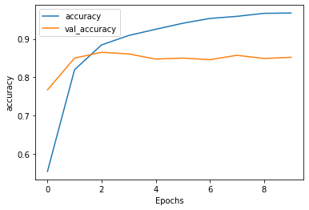
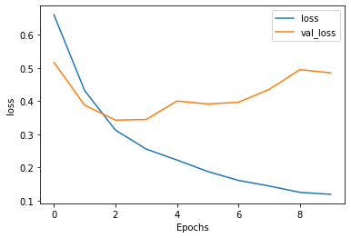

## Word Embeddings

### Why is using one-hot encoding an inefficient towards vectorizing a corpus of words?  How are word embeddings different?

Word embeddings gives a structure that holds relationships between words. They have locations in space, which can be subtracted.
A standard example would be that you could subtract Man from King and then add Woman to get the word queen. One hot encoding is bulky as it requires a 
dummy variable for every word.

### Compile and train the model from the tensorflow exercise.  Plot the training and validation loss as well as accuracy.  Post your plots and describe them

Both the accuracy and loss plots make it clear that five epochs was the best fit for this model. While training loss and 
accuracy continued to improve after five epochs, the testing loss and accuracy began to fall.

## Compile and train the model from the tensorflow exercise.  Plot the training and validation loss as well as accuracy.  Post your plots and describe them

This  model was best after 2-3 epochs. It is a good model that consistently had above 85% accuracy. For classification on
text this is an impressive result.

### Again compile and train the model from the tensorflow exercise.  Plot the training and validation loss as well as accuracy.  Stack two or more LSTM layers in your model.  Post your plots and describe them.

These plots show that adding the LSTM layers didn't have a drastic affect on performance. The loss and accuracy scores between
the models were nearly identical.

