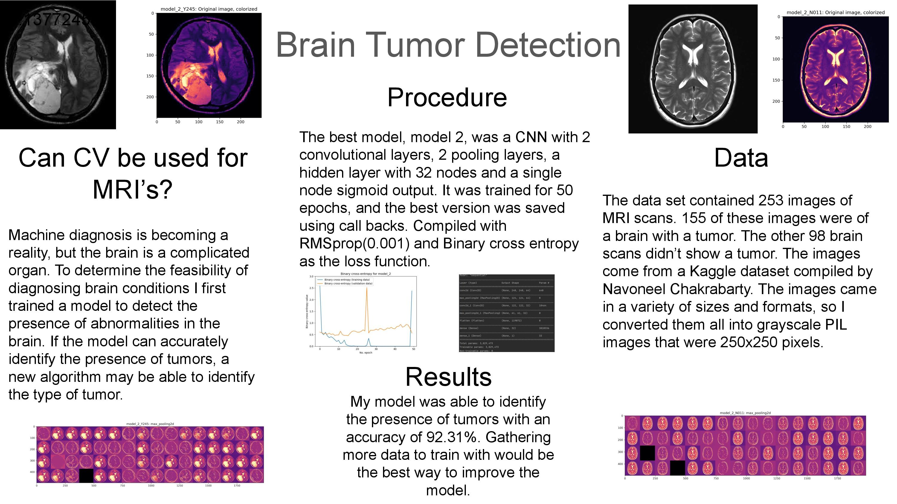

### Poster

### Research Question

Can computer vision be used to identify the presence of brain tumors using MRI scans?

### Data

I used a dataset of 253 images of brains with or without tumors. The images were all MRI scans taken in black and white.
They were stored in different sizes, resolutions and color schemes, so I adjusted them all to be grayscale and 250x250 
pixels. I used 90% of the data for training and 10% for testing.

### The Model

My model was a convolutional neural network with two convolutional layers, two poolings layers, a hidden layer with 32 
nodes and an output node with a sigmoid activation. I trained it for 50 epochs, then used a checkpoint to return it to
the 18th epochs weights, as they performed the best on the validation set. It had an accuracy of 100% on the test set and
92.31% on the test set. While overfit, this version of the model performed the best. It was the second of 5 models I tried,
and the first to reach an accuracy of 92.31%. Model 5 reached the same benchmark, but I chose not to use it as its 
test set loss values were worse.

### Further Work
Given the time to take this project further, I'd use a more robust dataset. 
I'd add more images of healthy and tumor carrying brains. I feel that more data would lead to a more accurate model.

Once I was satisfied with the model's ability to detect tumors, I'd make two classification models. One model that can 
classify the types of tumors I have selected and no tumors. Another that can only classify images into what type of tumor 
they have. I'd see if using the tumor detection model then the model that can only identify what type of model is more 
accurate than using just a categorical model with no tumor as a categoy.

