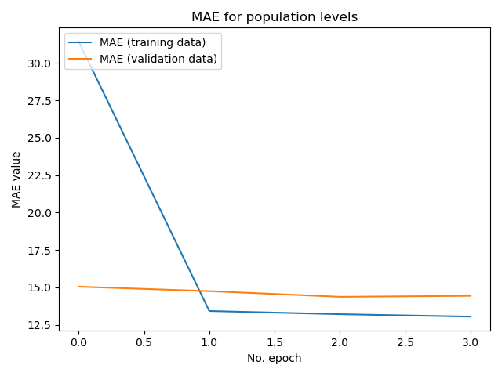
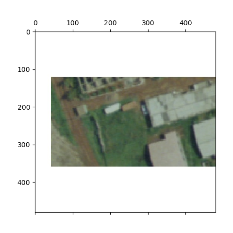
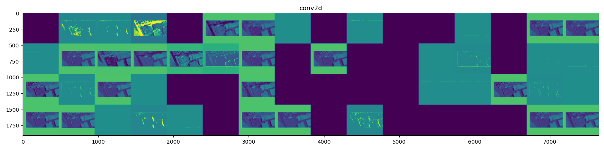
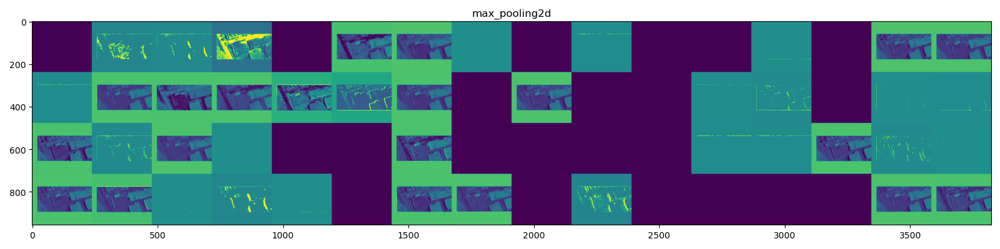
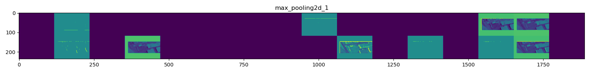
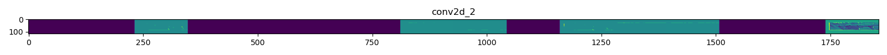
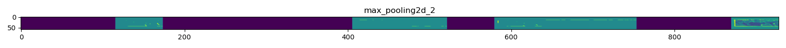
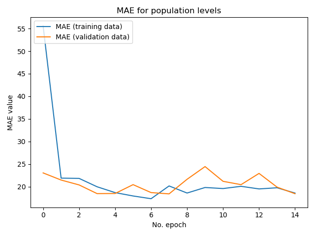
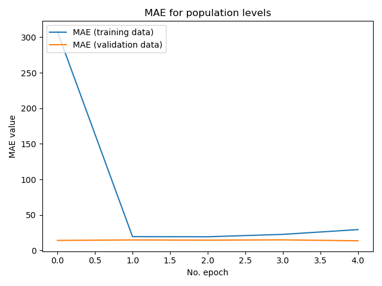

## Project 3

### What didn't work

This data set is by far the largest I've worked with. It is 10,000 photos of Accra, saved with a resolution of 480x480px
As I am splitting each pixel into 3 values, RGB, that's 10,000 * 480 * 480 * 3 * 4 bytes (each integer takes 4 bytes).
My Intel I5 with 8 gigs of RAM can't handle the full set.

I tried to run this project in Jupyterhub by installing Tensorflow onto it. After an hour of resolving conflicts,
Tensorflow failed to run. I had marginally more success using Google Colab. I could run Tensorflow on it and even upload
the images. However, it took a around seven minutes to upload 3,000 of the images. When it finished, Google started
reassigning the GPU they were letting me use. Everything I had uploaded had to be reuploaded. The second time this happened
I gave up on Google Colab. My last attempt was to run it off the William & Mary lab machines. Tensorflow asked for more
memory for 3,000 images than they were to assign me. I got an Out of Memory (OOM) error. I went back to running this
project on my own laptop.

My first model was a CNN and did extremely poorly. It only predicted values between 0 and 1. This is because I had a sigmoid activation
on my output node. It also had sparse categorical entropy as its loss function. As I am trying to predict continuous data,
that wasn't going to work. That was okay, I mostly just wanted to make sure I'd loaded and shaped my data properly. I
hadn't actually, but I thought I had and the model compiled, so I moved on.

I next tried to standardize the data. To take the RGB values that are on a scale of 0-255 and put them on a scale of 0-1
Floats are bigger than Ints. The smallest float I could cast my data to was a 16 byte float, four times bigger than the
ints I was using. Standardizing my data would cut down the number of observations I could have by four times, minimum. As
this dataset has a diverse range of images, I decided it would be better to not standardize the data and have more to train
on.

Here a classmate asked a question about the images not loading in the proper order compared to the labels. I checked my 
own images and found I had the same error. The images were being sorted by their string names, not the numerical values 
associated with those names. It was ordering them as 1, 10, 100 etc. instead of 1,2,3. I fixed this by taking the names 
of the images, for example "1.jpeg" and splitting off the numerical name. I turned that into an integer, then put it into
a tuple with the image. (1, 1.jpeg) where 1 is an int. I then sorted the images as a list of tuples by the ints. Finally
I popped the images out into a list using the sorted list of tuples.

I tried at one point using AveragePooling instead of MaxPooling. It hurt my model's performance so I switched back.

### Final models

Through experimentation I settled on using a CNN trained with 2900 images, with 100 for testing. The data was given to me
in four folders, the biggest of which each contained 3000 images so I used that. For additional testing I could always use
the other 7000 images the model never trained on. I've experimented with having just one convolution layer and pooling layer
as well as up to three of each. As each run with this size dataset takes over an hour and makes my computer completely
unusable for the duration, I haven't come to any conclusions about the right number of layers.

I've also tried using different numbers of epochs, from three to twenty. With this big of a dataset, three or four seems
to be the right number to maximize performance without overfitting. My current avenue of exploration is which set of training
data will provide the best results when predicting on other validation data. As such I trained models on the first and
second 3000 images.

## First Model Information
The first model I saved was trained on the first 3000 images. It trained for three epochs Here is a summary of its architecture:

Model: "sequential"

|Layer (type)        |         Output Shape       |       Param #   |
|---|----|----|
|conv2d (Conv2D)      |        (None, 478, 478, 64)   |   1792    |
|max_pooling2d (MaxPooling2D) |(None, 239, 239, 64)   |   0   |
|conv2d_1 (Conv2D)      |      (None, 237, 237, 32)  |    18464   |
|max_pooling2d_1 (MaxPooling2) |(None, 118, 118, 32)  |    0        |
|conv2d_2 (Conv2D)       |     (None, 116, 116, 16)   |   4624  |
|max_pooling2d_2 (MaxPooling2)| (None, 58, 58, 16)   |     0       |
|flatten (Flatten)      |      (None, 53824)     |        0      |
|dense (Dense)         |       (None, 16)         |       861200  |
|dense_1 (Dense)         |     (None, 8)       |          136     |
|dense_2 (Dense)       |       (None, 1)        |         9       |

Total params: 886,225

Trainable params: 886,225

Non-trainable params: 0

This model had a MAE of 14.442599296569824 and a MSE of 369.8353271484375 on the testing data.

A graph of its MAE as it trained:

Here is a csv of comparing each of its predictions to the actual values:
<a href="https://rmclanton.github.io/DS310_public/Project_3_ims/Results_on_test-acc1.csv">Model 1 Results</a>

### Plotting Layer outputs for the first model

Here is the feature extraction the model performed:

The image before the model begins extracting information

First convolution and MaxPooling

Second convolution and MaxPooling

Final convolution and MaxPooling

# Second Model Information
I trained this model on the next 3000 images. It trained for twenty epochs. It has the same architecture as the first 
model.

This second model performed far worse on the training and testing data. Likely because it became overfit and had harder
data to predict. It's MAE was 18.448226928710938 and MSE was 553.8238525390625 on the evaluation set.

Here is a csv of comparing each of its predictions to the actual values:
<a href="https://rmclanton.github.io/DS310_public/Project_3_ims/Results_on_test-acc2.csv">2sults</a>

A graph of its MAE as it trained:

As you can see, around three to four epochs gives the best performance.

I won't bother to plot this model's convolutions as they are the exact same as the first model's.

### Model 3

Model 3 has three changes. It has one different and less neural layers, it uses RMSprop for its optimization function and it
has less convolutional and pooling layers. It performed better on the validation set, with a mean squared error: of 
303.5134 and  mean absolute error: 13.6734. It was run on the same set of training and testing data as model 1.

## Model 3 Architecture

Model: "sequential"

|Layer (type)      |           Output Shape      |        Param #   |
|---|----|----|
|conv2d (Conv2D)              |(None, 478, 478, 64)   |   1792|      
|max_pooling2d (MaxPooling2D) |(None, 239, 239, 64)   |   0     |    
|conv2d_1 (Conv2D)            |(None, 237, 237, 32)    |  18464     |
|max_pooling2d_1 (MaxPooling2)| (None, 118, 118, 32)  |    0         |
|flatten (Flatten)         |   (None, 445568)         |   0 |        
|dense (Dense)            |    (None, 32)               | 14258208  |
|dense_1 (Dense)         |     (None, 1)               |  33        |

Total params: 14,278,497
Trainable params: 14,278,497
Non-trainable params: 0

Although the training MAE gets worse with additional epochs past the first two, this zoomed in plot shows that the model
does slightly better on the validation data on further epochs.

Predictions on the data set fo model 3. 
<a href="https://rmclanton.github.io/DS310_public/Project_3_ims/Results_on_test-acc1-mod3.csv">Model 3 Results</a>

### Final notes

Every model used the same train test split, with the same seed. This is to ensure I could evalute the models on the data
when I reload them. I used a batch size of 32 and 80 steps per epoch. The optimizer used was adam for the first two models.
MAE was used for the loss function. 

I think my model's performance would be improved by being able to feed it more data. I would also try to tune the number of
convolutions as well as the number of features. One approach to improve performance from a data cleaning standpoint would 
to cut out the whitespace in the images. 

This image is contained as a square, meaning it has whitespace above and below the actual data.
