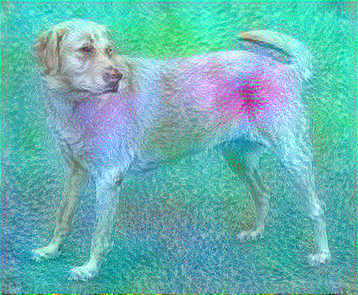
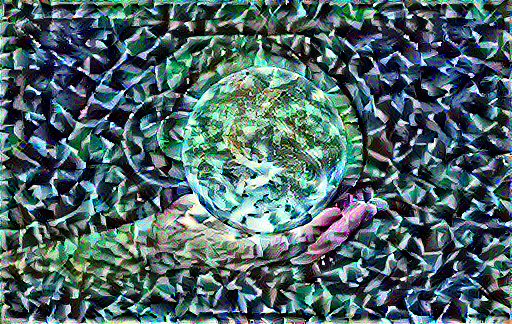

## T-shirt Designs

I decided that I wanted to go for a stained-glass look for this project. I tried it out on a couple of base images and 
found that for the best results there should be a dark background with empty space around a central object. This made each
segment that looks like glass appear larger. Each run took me 20-40 minutes depending on how much quality I wanted the
image to have, so I didn't get to test as many variations as I'd have liked. 
Still I'm satisfied with my final product. Here are the test runs:

First I ran it on the initial dog image. The sprinkled details were fine, where I wanted bigger individual pieces.

I next tried it on a couple of "Data Sciency" things. Here it is on a Neural net diagram. I'd prefer it to have ignored
the background, but it didn't. This one was a mess.

I switched up the style here and lowered the epochs to get faster results. Lowering the epochs increased the parts that look like noise
in the middle. I overwrote the original version made from 10 epochs, so I don't have it for comparison. This new style I chose
had large individual segments, which translated better towards my intention of having a stained glass look.

This image is the one where I found that a black background is the best. I didn't like the almost digitization affect on 
the satellite itself, so I decided to try out some different content images, with a space theme.

Here is the plot of the content image and the style image I chose for my latest iteration

This is the image I settled on. There isn't as much digitization on earth as there was on the satellite. I like how the 
hand came out through it. I'd probably given time filter the contrast of the image so that Earth would be broken up into 
pieces more like the arm. I think to make this the design I'd put whatever words we want either on the upper part of the 
Earth, or in see-through bubble letters behind it.

